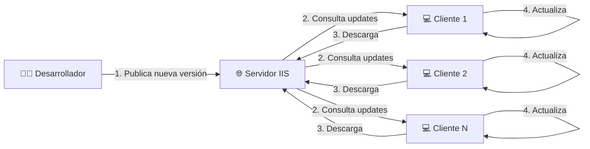
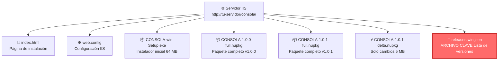
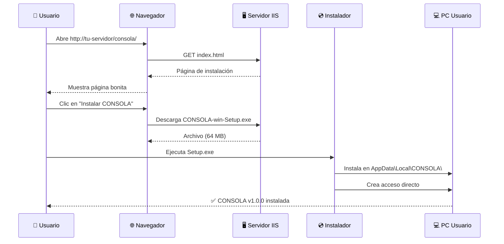
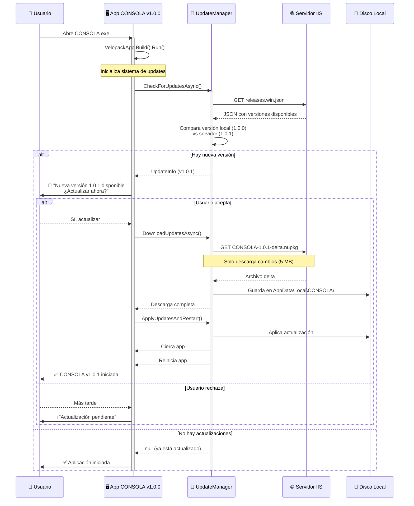
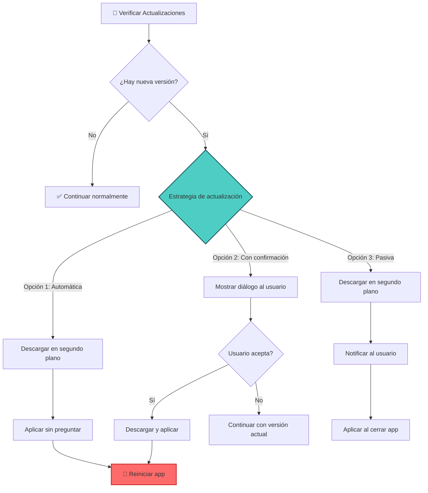
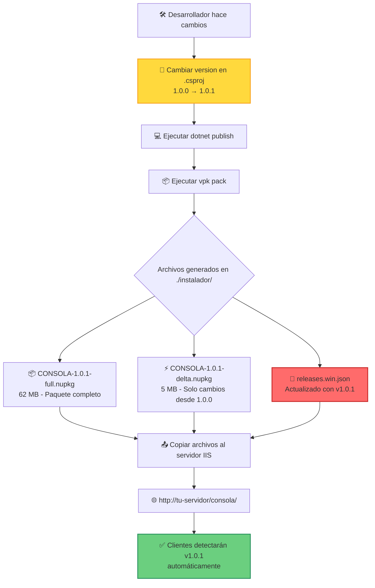
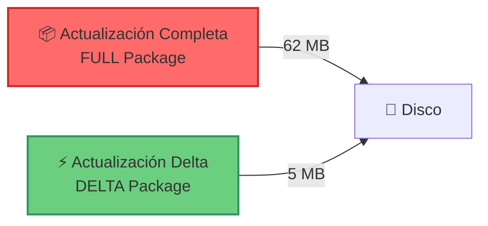
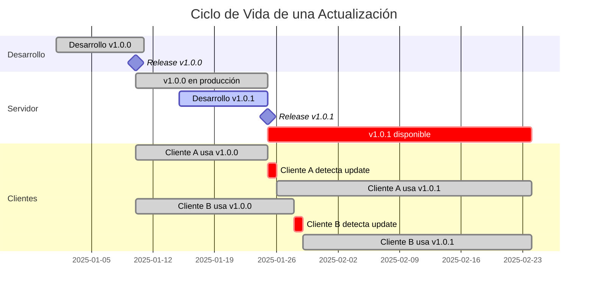
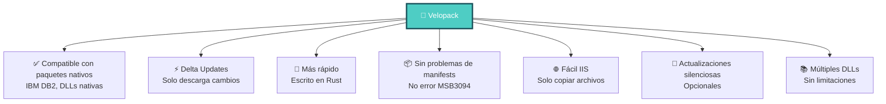
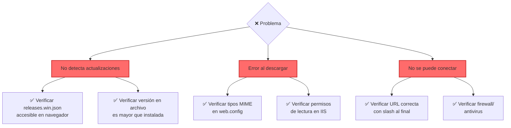

# 📦 Cómo Funciona el Sistema de Actualizaciones con Velopack

## 🎯 Visión General

El sistema de actualizaciones Velopack permite que tus aplicaciones WinForms se actualicen automáticamente, similar a ClickOnce pero sin sus limitaciones.



---

## 📁 Estructura del Servidor IIS



### Contenido de `releases.win.json` (Archivo Clave)

```json
{
  "releases": [
    {
      "version": "1.0.0",
      "filename": "CONSOLA-1.0.0-full.nupkg",
      "size": 65011234,
      "sha256": "abc123..."
    },
    {
      "version": "1.0.1",
      "filename": "CONSOLA-1.0.1-full.nupkg",
      "size": 65123456,
      "sha256": "def456...",
      "delta": "CONSOLA-1.0.1-delta.nupkg"
    }
  ]
}
```

---

## 🚀 Proceso de Instalación Inicial



---

## 🔄 Proceso de Actualización Automática

### Flujo Completo



### Opciones de Implementación



---

## 👨‍💻 Proceso de Publicación (Desarrollador)



### Comandos para Publicar

```bash
# 1. Cambiar versión en CONSOLA.csproj
<Version>1.0.1</Version>

# 2. Publicar aplicación
dotnet publish -c Release -r win-x64 -o ./publish

# 3. Crear instalador y paquetes de actualización
vpk pack --packId CONSOLA --packVersion 1.0.1 \
         --packDir ./publish \
         --mainExe CONSOLA.exe \
         --outputDir ./instalador

# 4. Copiar archivos al servidor IIS
# - CONSOLA-1.0.1-full.nupkg
# - CONSOLA-1.0.1-delta.nupkg (si existe)
# - releases.win.json (¡IMPORTANTE!)
```

---

## 📊 Comparación de Tamaños de Descarga



**Ventaja de Delta Updates:**
- Usuario con v1.0.0 → v1.0.1: Solo descarga **5 MB** (delta)
- Usuario nuevo o muy desactualizado: Descarga **62 MB** (full)

---

## 🔍 Detección de Actualizaciones - Timeline



---

## 💡 Ejemplos de Código

### Ejemplo 1: Actualización Automática (Silenciosa)

```csharp
static async Task Main(string[] args)
{
    // SIEMPRE primero
    VelopackApp.Build().Run();

    var updateManager = new UpdateManager("http://tu-servidor/consola/");

    try
    {
        var updateInfo = await updateManager.CheckForUpdatesAsync();
        if (updateInfo != null)
        {
            // Descargar y aplicar automáticamente
            await updateManager.DownloadUpdatesAsync(updateInfo);
            updateManager.ApplyUpdatesAndRestart(updateInfo);
            return; // Sale para reiniciar
        }
    }
    catch (Exception ex)
    {
        Console.WriteLine($"No se pudo verificar actualizaciones: {ex.Message}");
    }

    // Tu aplicación continúa...
    Application.Run(new FormPrincipal());
}
```

### Ejemplo 2: Con Confirmación del Usuario

```csharp
protected override async void OnLoad(EventArgs e)
{
    base.OnLoad(e);

    var updateManager = new UpdateManager("http://tu-servidor/consola/");
    var updateInfo = await updateManager.CheckForUpdatesAsync();

    if (updateInfo != null)
    {
        var version = updateInfo.TargetFullRelease.Version;
        var result = MessageBox.Show(
            $"Nueva versión {version} disponible.\n¿Actualizar ahora?",
            "Actualización Disponible",
            MessageBoxButtons.YesNo,
            MessageBoxIcon.Information
        );

        if (result == DialogResult.Yes)
        {
            await updateManager.DownloadUpdatesAsync(updateInfo);
            updateManager.ApplyUpdatesAndRestart(updateInfo);
        }
    }
}
```

### Ejemplo 3: Descarga en Segundo Plano

```csharp
private async Task DescargarActualizacionEnSegundoPlano()
{
    var updateManager = new UpdateManager("http://tu-servidor/consola/");
    var updateInfo = await updateManager.CheckForUpdatesAsync();

    if (updateInfo != null)
    {
        // Descargar sin interrumpir al usuario
        await updateManager.DownloadUpdatesAsync(updateInfo);

        // Mostrar notificación discreta
        notifyIcon1.ShowBalloonTip(
            3000,
            "Actualización Descargada",
            "Se aplicará al cerrar la aplicación",
            ToolTipIcon.Info
        );

        // Aplicar al cerrar
        Application.ApplicationExit += (s, e) => {
            updateManager.ApplyUpdatesAndExit();
        };
    }
}
```

---

## ✅ Ventajas de Velopack vs ClickOnce



---

## 🎓 Resumen para Desarrolladores

### 🎯 Lo que necesitas saber:

1. **Primera configuración** (una sola vez):
   - Copiar carpeta `./instalador/` a servidor IIS
   - Configurar URL en tu aplicación

2. **Para cada nueva versión**:
   ```bash
   # Paso 1: Cambiar versión
   <Version>1.0.X</Version>

   # Paso 2: Compilar y empaquetar
   dotnet publish -c Release -r win-x64 -o ./publish
   vpk pack --packId CONSOLA --packVersion 1.0.X --packDir ./publish --mainExe CONSOLA.exe --outputDir ./instalador

   # Paso 3: Copiar al servidor
   # - *.nupkg
   # - releases.win.json
   ```

3. **Los clientes se actualizan solos** ✨

### 🔑 Archivos Clave

| Archivo | Propósito | Ubicación |
|---------|-----------|-----------|
| `releases.win.json` | 🔑 Lista de versiones (consultado por clientes) | Servidor IIS |
| `*.nupkg` | 📦 Paquetes de actualización | Servidor IIS |
| `UpdateManager.cs` | 🔧 Gestiona actualizaciones en la app | Código de la app |
| `VelopackApp.Build().Run()` | ⚙️ Inicializa sistema | Primera línea de Main() |

---

## 🆘 Solución de Problemas



---

## 📞 Recursos Adicionales

- 📄 **ACTUALIZACIONES.md** - Documentación completa con todos los ejemplos
- 💻 **UpdateManager.cs** - Clase reutilizable para gestionar updates
- 🖼️ **FormPrincipal.cs** - Ejemplo de implementación en WinForms
- 📋 **CLAUDE.md** - Guía general del proyecto

---

**¡Eso es todo!** 🎉

El sistema está diseñado para ser simple:
1. Publicas nueva versión al servidor
2. Los clientes detectan y descargan automáticamente
3. Usuario reinicia y tiene la última versión

**No necesitas hacer nada más.** ✨
