# 🌐 Configuración de IIS para CONSOLA

## Requisitos Previos

- Windows Server o Windows 10/11 con IIS instalado
- Permisos de administrador
- .NET Runtime instalado en el servidor (no requerido para aplicación cliente)

---

## 📋 Flujo General de Configuración

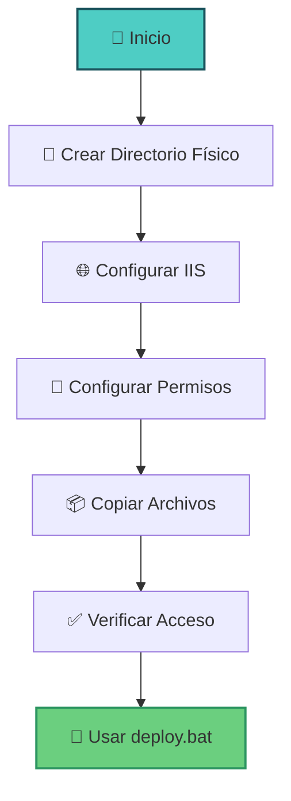

---

## 🗂️ Estructura de Directorios

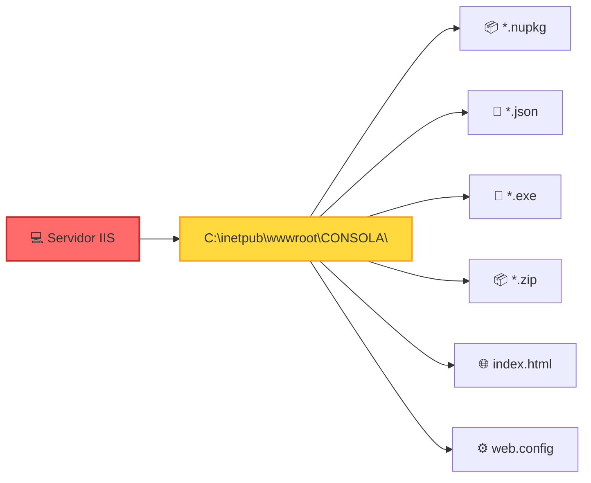

---

## 📋 Pasos para Configurar IIS

### 1. Crear Directorio Físico

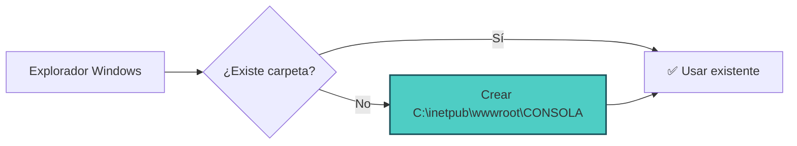

Crea la carpeta donde estarán los archivos del instalador:

```
C:\inetpub\wwwroot\CONSOLA\
```

O usa una ruta de red compartida:
```
\\localhost\Sitios$\CONSOLA\
```

### 2. Abrir Administrador de IIS

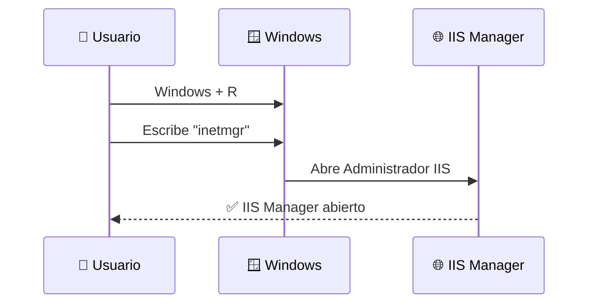

1. Presiona `Windows + R`
2. Escribe: `inetmgr`
3. Presiona Enter

### 3. Crear Sitio Web en IIS

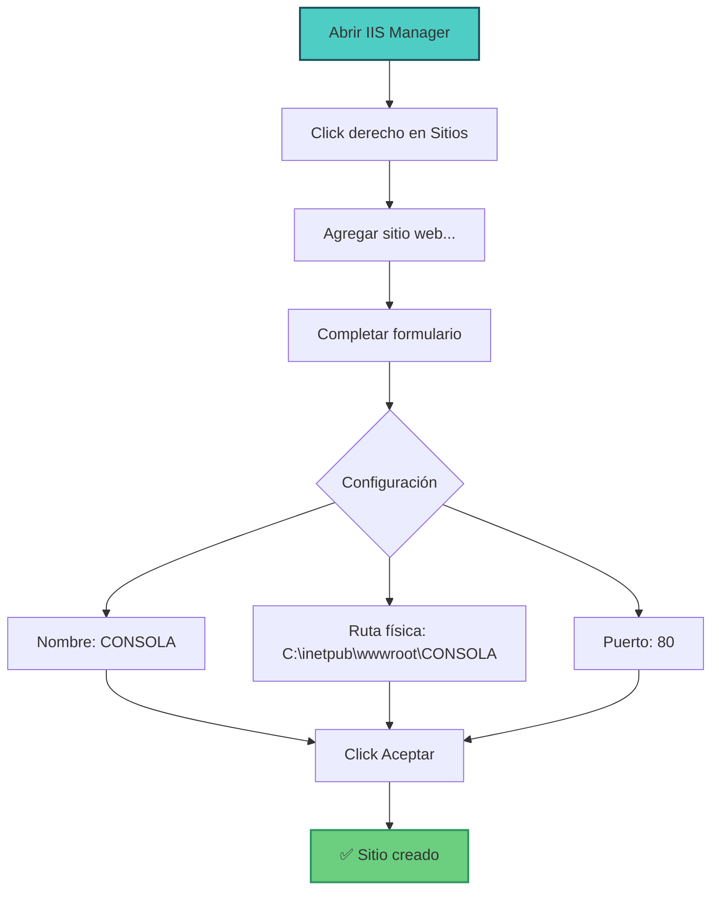

**Pasos detallados:**

1. En **IIS Manager**, panel izquierdo
2. Click derecho en **"Sitios"**
3. Seleccionar **"Agregar sitio web..."**
4. En el formulario que aparece:
   ```
   Nombre del sitio:        CONSOLA
   Ruta de acceso física:   C:\inetpub\wwwroot\CONSOLA  [Buscar...]

   Enlace:
   Tipo:                    http
   Dirección IP:            Todas las no asignadas
   Puerto:                  80
   Nombre de host:          (dejar vacío)
   ```
5. Click **"Aceptar"**
6. El sitio aparecerá en la lista y se iniciará automáticamente

**Verificar**: En el panel derecho debe aparecer el sitio "CONSOLA" con estado "Iniciado" (luz verde)

### 4. Configurar Permisos (Importante)

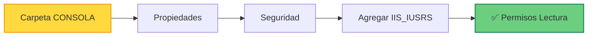

**Pasos rápidos:**

1. Abrir `C:\inetpub\wwwroot\CONSOLA` en Explorador
2. Click derecho → **Propiedades** → Pestaña **Seguridad**
3. Click **Editar...** → **Agregar...**
4. Escribir: `IIS_IUSRS` → **Comprobar nombres** → **Aceptar**
5. Con `IIS_IUSRS` seleccionado, marcar:
   - ☑ **Lectura y ejecución**
   - ☑ **Mostrar el contenido de la carpeta**
   - ☑ **Leer**
6. **Aplicar** → **Aceptar**

### 5. Copiar Archivos al Servidor


**Comando rápido:**

```batch
xcopy /Y "C:\sistemas\prueba conexion informix\CONSOLA\instalador\*.*" "C:\inetpub\wwwroot\CONSOLA\"
```

**O manualmente:** Copiar todos los archivos de `./instalador/` a `C:\inetpub\wwwroot\CONSOLA\`

**Archivos que se copian:**
- ✅ `*.nupkg` (paquetes de actualización)
- ✅ `releases.win.json` (manifiesto de versiones)
- ✅ `CONSOLA-win-Setup.exe` (instalador)
- ✅ `index.html` y `web.config`

### 6. Verificar Tipos MIME (Opcional)

El archivo `web.config` ya incluye los tipos MIME necesarios. **Si tienes problemas de descarga**, verifica:

1. En IIS Manager, selecciona sitio **CONSOLA**
2. Doble click en **Tipos MIME**
3. Busca estas extensiones:

| Extensión | Tipo MIME | Estado |
|-----------|-----------|--------|
| `.nupkg` | `application/octet-stream` | Debe existir |
| `.json` | `application/json` | Debe existir |

Si no existen, agregar manualmente con **Agregar...** en el panel derecho

### 7. Probar que Funciona

Abre un navegador y prueba estas URLs:

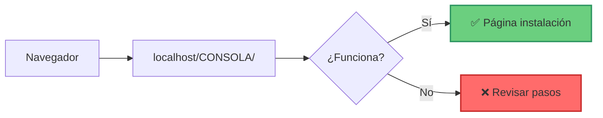

**Pruebas básicas:**

| Prueba | URL | Resultado esperado |
|--------|-----|-------------------|
| 1️⃣ Página principal | `http://localhost/CONSOLA/` | Muestra página de instalación |
| 2️⃣ Manifiesto | `http://localhost/CONSOLA/releases.win.json` | Muestra JSON con versiones |
| 3️⃣ Instalador | `http://localhost/CONSOLA/CONSOLA-win-Setup.exe` | Descarga archivo (100 MB) |

✅ **Si las 3 pruebas funcionan, IIS está correctamente configurado**

---

## 🔧 Configuración del web.config

El archivo `web.config` ya está en `./instalador/web.config`:

```xml
<?xml version="1.0" encoding="UTF-8"?>
<configuration>
    <system.webServer>
        <!-- Tipos MIME para archivos de Velopack -->
        <staticContent>
            <mimeMap fileExtension=".nupkg" mimeType="application/octet-stream" />
            <mimeMap fileExtension=".json" mimeType="application/json" />
        </staticContent>

        <!-- Habilitar CORS (opcional) -->
        <httpProtocol>
            <customHeaders>
                <add name="Access-Control-Allow-Origin" value="*" />
            </customHeaders>
        </httpProtocol>

        <!-- Compresión -->
        <urlCompression doStaticCompression="true" />
    </system.webServer>
</configuration>
```

---

## 🚀 Uso del Script de Deploy

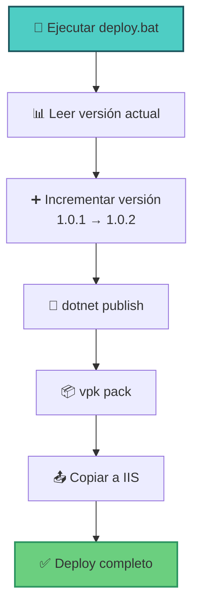

### Configurar Rutas en deploy.bat

Edita `deploy.bat`:

```batch
set IIS_DST=C:\inetpub\wwwroot\CONSOLA
```

### Ejecutar Deploy

```batch
cd "C:\sistemas\prueba conexion informix\CONSOLA"
deploy.bat
```

El script automáticamente:
1. ✅ Incrementa versión automáticamente
2. ✅ Compila aplicación
3. ✅ Genera paquetes Velopack
4. ✅ Copia archivos a IIS
5. ✅ Muestra resumen

---

## 🌍 Acceso desde Otros Equipos

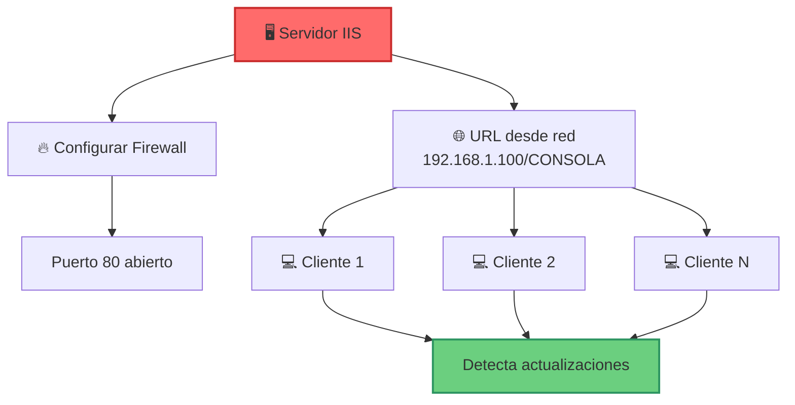

### En el Servidor

1. Firewall de Windows → **"Configuración avanzada"**
2. **"Reglas de entrada"** → Habilitar: **"World Wide Web Services (HTTP Traffic-In)"**

### En las PCs Cliente

Actualiza la URL en `FormLogin.cs` y `FormPrincipal.cs`:

```csharp
_updateManager = new UpdateManager("http://192.168.1.100/CONSOLA/");
```

---

## 🔍 Solución de Problemas

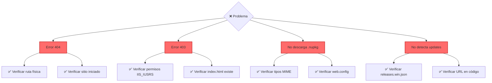

### Error 404: No se encuentra la página
- Verifica ruta física correcta
- Verifica que el sitio esté iniciado

### Error 403: Acceso prohibido
- Verifica permisos de `IIS_IUSRS`
- Verifica que exista `index.html`

### No descarga archivos .nupkg
- Verifica tipos MIME en IIS
- Verifica que `web.config` esté presente

### Los clientes no detectan actualizaciones
- Verifica acceso a `releases.win.json`
- Verifica URL en el código
- Verifica firewall/antivirus

---

## 📊 Arquitectura Completa

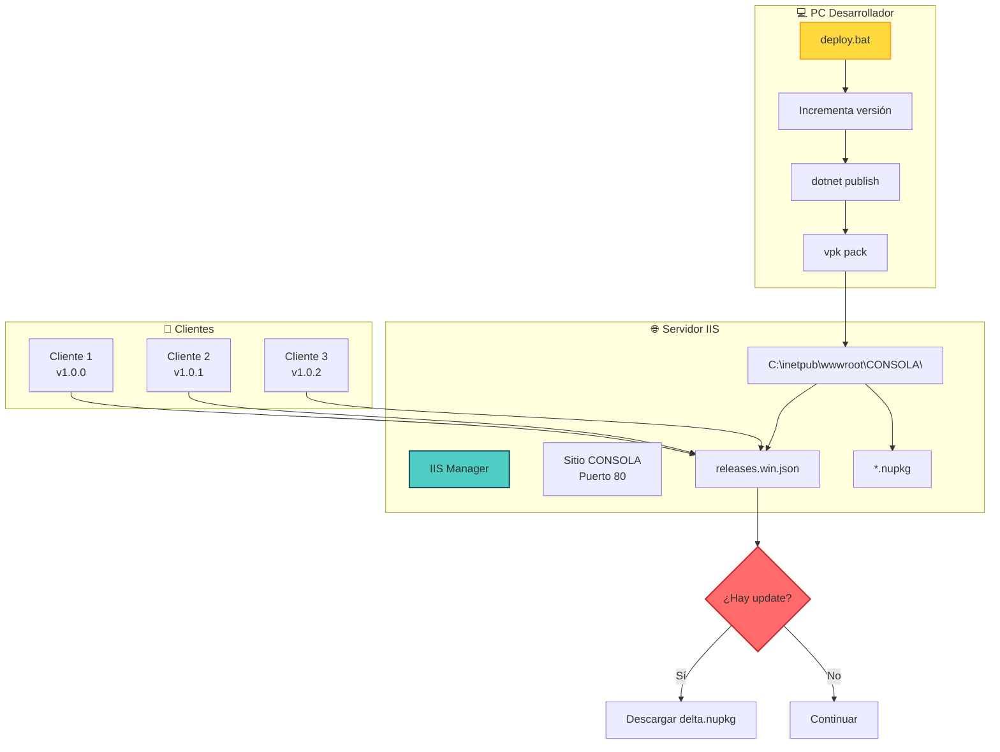

---

## ✅ Checklist de Configuración

- [ ] IIS instalado y funcionando
- [ ] Carpeta física creada (C:\inetpub\wwwroot\CONSOLA)
- [ ] Sitio web o aplicación creada en IIS
- [ ] Permisos de IIS_IUSRS configurados
- [ ] Tipos MIME verificados (.nupkg, .json)
- [ ] Archivos copiados desde ./instalador/
- [ ] Prueba: http://localhost/CONSOLA/
- [ ] Prueba: http://localhost/CONSOLA/releases.win.json
- [ ] Firewall configurado (si acceso remoto)
- [ ] URL actualizada en código cliente
- [ ] deploy.bat configurado con ruta correcta

---

## 🎯 Resultado Final

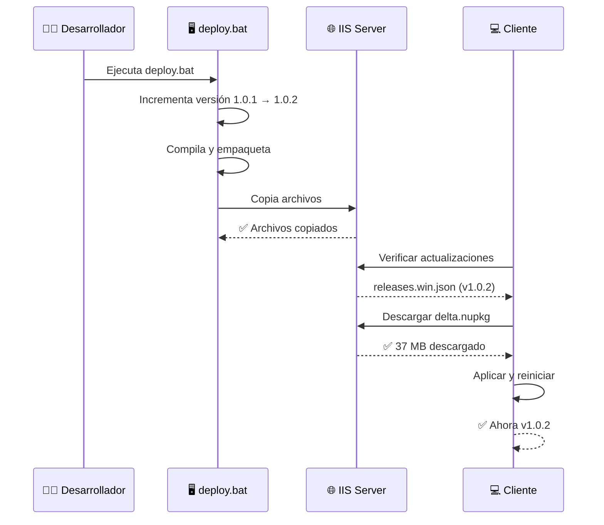

¡Listo! Sistema completamente configurado y funcional.
