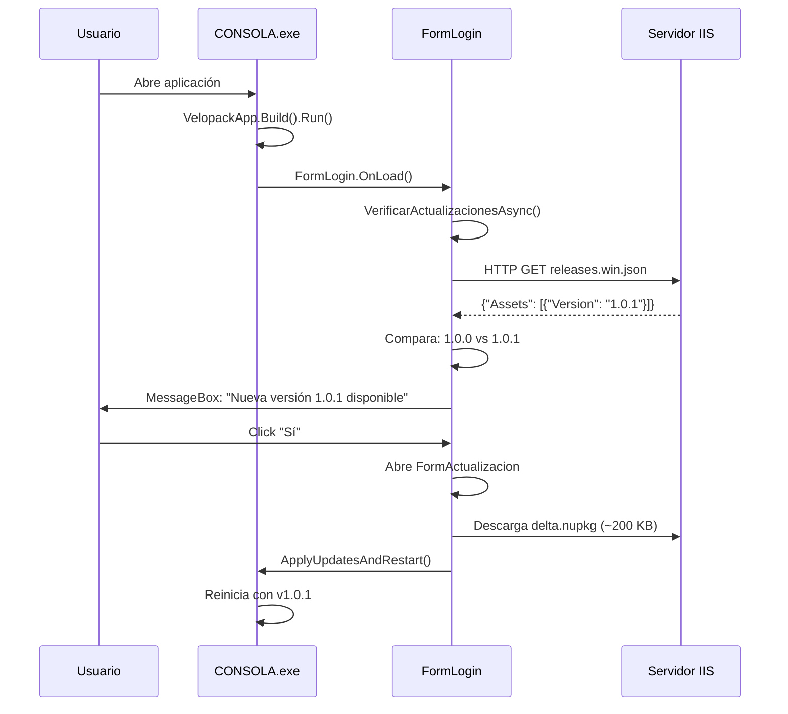
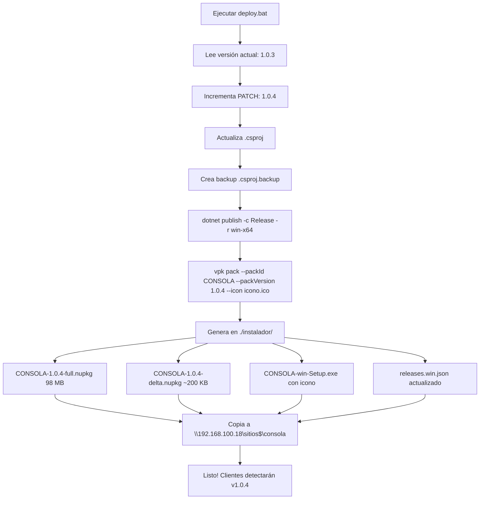

# 🔄 Guía Completa del Sistema de Actualizaciones con Velopack

---

## 📑 Tabla de Contenidos

1. [Instalaciones Iniciales](#parte-1-instalaciones-iniciales)
2. [Configuración del Servidor IIS](#parte-2-configuración-del-servidor-iis)
3. [Implementar en Otro Proyecto](#parte-3-implementar-actualizaciones-en-otro-proyecto)
4. [Cómo Funciona el Sistema](#parte-4-cómo-funciona-el-sistema)

---

# PARTE 1: INSTALACIONES INICIALES

## 1.1. Instalar .NET 8.0 SDK

Descargar desde: [https://dotnet.microsoft.com/download/dotnet/8.0](https://dotnet.microsoft.com/download/dotnet/8.0)

**Verificar instalación:**

```bash
dotnet --version
# Output: 8.0.xxx
```

---

## 1.2. Instalar Velopack CLI

Abrir terminal/PowerShell como **Administrador**:

```bash
dotnet tool install -g vpk
```

**Verificar instalación:**

```bash
vpk --version
# Output: 0.0.xxx
```

---

## 1.3. Agregar Paquete NuGet de Velopack al Proyecto

### Opción A - Desde Visual Studio

1. Click derecho en el proyecto → **"Administrar paquetes NuGet"**
2. Buscar: **"Velopack"**
3. Instalar el paquete **"Velopack"** (versión 0.0.1298 o superior)

### Opción B - Desde línea de comandos

```bash
cd C:\ruta\a\tu\proyecto
dotnet add package Velopack
```

### Opción C - Editar manualmente .csproj

Agregar dentro de `<ItemGroup>`:

```xml
<ItemGroup>
  <PackageReference Include="Velopack" Version="0.0.1298" />
</ItemGroup>
```

Luego ejecutar:

```bash
dotnet restore
```

---

## 1.4. Verificar que Todo Está Instalado

```bash
dotnet --version
# ✓ 8.0.xxx

vpk --version
# ✓ 0.0.xxx

dotnet list package
# ✓ Velopack    0.0.1298
```

---

# PARTE 2: CONFIGURACIÓN DEL SERVIDOR IIS

## 2.1. Estructura del Servidor

```
Servidor Web (IIS)
https://consultas.santarosa.gob.ec/consola/
│
├── index.html                     # Página de instalación
├── web.config                     # Configuración IIS
├── CONSOLA-win-Setup.exe         # Instalador inicial (con icono)
├── CONSOLA-1.0.0-full.nupkg      # Paquete versión 1.0.0
├── CONSOLA-1.0.1-full.nupkg      # Paquete versión 1.0.1
├── CONSOLA-1.0.1-delta.nupkg     # Solo cambios 1.0.0→1.0.1 (~200 KB)
└── releases.win.json              # ¡ARCHIVO CLAVE! Lista versiones
```

---

## 2.2. Pasos para Configurar IIS

### 1. Crear carpeta física

```
C:\sitios\consola\
```

### 2. Compartir carpeta en red (opcional)

- Click derecho → **Propiedades** → **Compartir**
- Nombre del recurso: `sitios$`
- Acceso: `\\192.168.100.18\sitios$\consola`

### 3. Abrir IIS Manager

```
Windows + R → inetmgr
```

### 4. Agregar sitio web

- Click derecho en **"Sitios"** → **"Agregar sitio web"**
- **Nombre del sitio:** CONSOLA
- **Ruta física:** `C:\sitios\consola`
- **Puerto:** 80 (o el que prefieras)
- **Nombre de host:** consultas.santarosa.gob.ec

### 5. Configurar permisos

- Click derecho en `C:\sitios\consola` → **Propiedades** → **Seguridad**
- **Agregar usuario:** `IIS_IUSRS`
- **Permisos:** Lectura y ejecución, Leer

### 6. Copiar archivos al servidor

- `index.html` (página de instalación)
- `web.config` (tipos MIME para .nupkg)

> 📖 Ver archivo: `CONFIGURACION_IIS.md` para detalles completos

---

## 2.3. Archivo web.config (Tipos MIME)

Ya está incluido en: `./instalador/web.config`

**Configura tipos MIME para:**

| Extensión | Tipo MIME |
|-----------|-----------|
| `.nupkg` | `application/octet-stream` |
| `.json` | `application/json` |
| `.exe` | `application/octet-stream` |
| `.zip` | `application/zip` |

---

# PARTE 3: IMPLEMENTAR ACTUALIZACIONES EN OTRO PROYECTO

## 3.1. Archivos que Necesitas Copiar de Este Proyecto

| Archivo | Descripción |
|---------|-------------|
| ✅ `UpdateManager.cs` | Wrapper de Velopack |
| ✅ `FormActualizacion.cs` | Formulario con barra de progreso |
| ✅ `icono.ico` | Icono de la aplicación |
| ✅ `deploy.bat` | Script de despliegue automatizado |
| ✅ `instalador/web.config` | Configuración IIS |
| ✅ `instalador/index.html` | Página de instalación |

---

## 3.2. Modificar Tu Proyecto

### PASO 1: Agregar paquete NuGet Velopack

```bash
dotnet add package Velopack
```

O editar `.csproj`:

```xml
<ItemGroup>
  <PackageReference Include="Velopack" Version="0.0.1298" />
</ItemGroup>
```

---

### PASO 2: Configurar .csproj

Agregar en `<PropertyGroup>`:

```xml
<PropertyGroup>
  <OutputType>WinExe</OutputType>
  <TargetFramework>net8.0-windows</TargetFramework>
  <UseWindowsForms>true</UseWindowsForms>
  <Version>1.0.0</Version>
  <Platforms>AnyCPU;x64</Platforms>
  <ApplicationIcon>icono.ico</ApplicationIcon>
</PropertyGroup>
```

---

### PASO 3: Modificar Program.cs

```csharp
using Velopack;

internal class Program
{
    // URL del servidor donde están las actualizaciones
    public static string rutaActualizaciones = "https://tu-servidor/tu-app/";

    [STAThread]
    static void Main(string[] args)
    {
        // IMPORTANTE: SIEMPRE PRIMERO
        VelopackApp.Build().Run();

        Application.EnableVisualStyles();
        Application.SetCompatibleTextRenderingDefault(false);
        Application.Run(new FormPrincipal());
    }
}
```

---

### PASO 4: Modificar tu FormPrincipal (o FormLogin)

```csharp
using Velopack;

public partial class FormPrincipal : Form
{
    private readonly UpdateManager _updateManager;
    private UpdateInfo? _updateInfoPendiente = null;

    public FormPrincipal()
    {
        InitializeComponent();

        // Inicializar gestor de actualizaciones
        _updateManager = new UpdateManager(Program.rutaActualizaciones);

        // Mostrar versión en título
        this.Text = $"Mi App - Versión {_updateManager.ObtenerVersionActual()}";
    }

    // Verificar actualizaciones al cargar
    protected override async void OnLoad(EventArgs e)
    {
        base.OnLoad(e);
        await VerificarActualizacionesAsync(mostrarMensajeSiNoHay: false);
    }

    // Timer para verificar cada 5 minutos
    private async void timerActualizaciones_Tick(object sender, EventArgs e)
    {
        await VerificarActualizacionesAsync(mostrarMensajeSiNoHay: false);
    }

    // Lógica de verificación
    private async Task VerificarActualizacionesAsync(bool mostrarMensajeSiNoHay)
    {
        try
        {
            var updateInfo = await _updateManager.VerificarActualizacionesAsync();

            if (updateInfo != null)
            {
                // HAY ACTUALIZACIÓN
                _updateInfoPendiente = updateInfo;
                var version = updateInfo.TargetFullRelease.Version;

                var resultado = MessageBox.Show(
                    $"Nueva versión {version} disponible.\n\n¿Desea descargar e instalar ahora?",
                    "Actualización Disponible",
                    MessageBoxButtons.YesNo,
                    MessageBoxIcon.Information
                );

                if (resultado == DialogResult.Yes)
                {
                    IniciarDescargaYActualizacion(updateInfo);
                }
            }
            else if (mostrarMensajeSiNoHay)
            {
                MessageBox.Show("Ya tiene la última versión.", "Sin Actualizaciones",
                    MessageBoxButtons.OK, MessageBoxIcon.Information);
            }
        }
        catch (Exception ex)
        {
            // Error de red, servidor no disponible, etc.
        }
    }

    private void IniciarDescargaYActualizacion(UpdateInfo updateInfo)
    {
        using (var formActualizacion = new FormActualizacion(_updateManager, updateInfo))
        {
            formActualizacion.ShowDialog(this);
        }
    }
}
```

---

### PASO 5: Agregar Timer en el Designer

En `FormPrincipal.Designer.cs` (o `FormLogin.Designer.cs`):

```csharp
private System.Windows.Forms.Timer timerActualizaciones;

private void InitializeComponent()
{
    this.timerActualizaciones = new System.Windows.Forms.Timer(this.components);

    // Timer configuración
    this.timerActualizaciones.Enabled = true;
    this.timerActualizaciones.Interval = 300000; // 5 minutos
    this.timerActualizaciones.Tick += new System.EventHandler(this.timerActualizaciones_Tick);
}
```

---

### PASO 6: Modificar deploy.bat

Editar las rutas en `deploy.bat`:

```batch
set IIS_DST=\\tu-servidor\carpeta$\tu-app
```

El resto se configura automáticamente usando `%~dp0`

---

## 3.3. Primer Despliegue

### 1. Compilar y probar localmente

```bash
dotnet build
```

### 2. Ejecutar deploy.bat

```bash
deploy.bat
```

Esto genera en `./instalador/`:
- `CONSOLA-1.0.0-full.nupkg`
- `CONSOLA-win-Setup.exe`
- `releases.win.json`
- `index.html`
- `web.config`

### 3. Los archivos se copian automáticamente al servidor de red

### 4. Usuarios pueden instalar desde

```
https://tu-servidor/tu-app/
```

---

# PARTE 4: CÓMO FUNCIONA EL SISTEMA

## 4.1. Instalación Inicial por Usuario

```mermaid
graph LR
    A[Usuario] --> B[Navegador]
    B --> C[https://consultas.santarosa.gob.ec/consola/]
    C --> D[Ve index.html]
    D --> E[Clic: Instalar CONSOLA]
    E --> F[Descarga CONSOLA-win-Setup.exe]
    F --> G[Ejecuta instalador]
    G --> H[Instala en AppData\Local\CONSOLA]
    H --> I[Crea acceso directo con icono]
    I --> J[Registra en Agregar/Quitar Programas]
```



**Resultado:**
- ✅ Instalado en: `C:\Users\Usuario\AppData\Local\CONSOLA\`
- ✅ Acceso directo en Escritorio (con icono)
- ✅ Registrado en Agregar/Quitar Programas (con icono)
- ✅ Versión instalada: 1.0.0

---

## 4.2. Verificación de Actualizaciones (3 Momentos)

### A) 🚀 AL INICIAR LA APLICACIÓN (FormLogin.OnLoad)



**Flujo:**
1. Usuario abre `CONSOLA.exe`
2. `VelopackApp.Build().Run()` (inicializa sistema)
3. `FormLogin.OnLoad()` ejecuta automáticamente
4. `VerificarActualizacionesAsync(mostrarMensajeSiNoHay: false)`
5. **HTTP GET:** `releases.win.json`
6. Compara: Instalada (1.0.0) vs Servidor (1.0.1)
7. ¡**HAY ACTUALIZACIÓN**!
8. Muestra MessageBox: "Nueva versión 1.0.1 disponible"
9. Si usuario acepta:
   - Abre `FormActualizacion`
   - Descarga `CONSOLA-1.0.1-delta.nupkg` (~200 KB)
   - Muestra barra de progreso
   - `ApplyUpdatesAndRestart()`
   - Cierra la app
   - Reinicia con versión 1.0.1

---

### B) ⏰ CADA 5 MINUTOS (Timer Automático)

```csharp
Timer: timerActualizaciones
Interval: 300000 ms (5 minutos)

timerActualizaciones_Tick()
└─► VerificarActualizacionesAsync(mostrarMensajeSiNoHay: false)
    └─► HTTP GET: releases.win.json
        └─► Si hay actualización:
            ├─ Muestra botón "Click para Actualizar" (verde/amarillo)
            └─ Al hacer clic, inicia descarga
```

---

### C) 🔍 MANUAL (Menú Ayuda → Buscar Actualizaciones)

```csharp
Usuario → Menú Ayuda → Buscar Actualizaciones
│
└─► menuBuscarActualizaciones_Click()
    └─► VerificarActualizacionesAsync(mostrarMensajeSiNoHay: true)
        ├─► HTTP GET: releases.win.json
        ├─► Si HAY actualización:
        │   └─ Muestra MessageBox para instalar
        └─► Si NO hay actualización:
            └─ Muestra: "Ya tiene la última versión"
```

---

## 4.3. Publicar Nueva Versión (Desarrollador - AUTOMÁTICO)

### Proceso Automatizado con deploy.bat



**Comando:**

```bash
deploy.bat
```

**Salida:**

```
[1/5] Incrementando version... 1.0.3 → 1.0.4
[2/5] Publicando aplicacion... ✓
[3/5] Creando paquetes con Velopack... ✓
[4/5] Copiando al servidor IIS... ✓
[5/5] DEPLOY COMPLETADO
```

**Genera en `./instalador/`:**
- `CONSOLA-1.0.4-full.nupkg` (98 MB - versión completa)
- `CONSOLA-1.0.4-delta.nupkg` (~200 KB - solo cambios)
- `CONSOLA-win-Setup.exe` (instalador con icono)
- `releases.win.json` (actualizado con v1.0.4)

**Copia automática al servidor:**

```batch
xcopy *.nupkg \\192.168.100.18\sitios$\consola\
xcopy *.json  \\192.168.100.18\sitios$\consola\
xcopy *.exe   \\192.168.100.18\sitios$\consola\
```

---

## 4.4. Flujo Automático en Cada Cliente (Ejemplo)

| Momento | Acción | Resultado |
|---------|--------|-----------|
| **Día 1, 10:00 AM** | Usuario instala v1.0.3 | ✅ App instalada |
| **Día 2, 3:00 PM** | Desarrollador ejecuta `deploy.bat` | ✅ v1.0.4 publicada en servidor |
| **Día 3, 9:00 AM** | Usuario abre app | `FormLogin.OnLoad()` detecta v1.0.4 |
| | | Muestra: "Nueva versión 1.0.4 disponible" |
| | | Usuario acepta |
| | | Descarga 200 KB (delta) |
| | | Actualiza y reinicia |
| | | ✅ Usuario tiene v1.0.4 |
| **Día 3, 9:15 AM** | Timer verifica (5 min después) | Ya actualizado, no hace nada |
| **Día 3, 2:00 PM** | Usuario usa menú "Buscar Actualizaciones" | "Ya tiene la última versión" |

---

## 📦 Archivo Clave: releases.win.json

> Este archivo es consultado por **TODOS** los clientes para saber si hay una nueva versión disponible.

**Ubicación:**
```
https://consultas.santarosa.gob.ec/consola/releases.win.json
```

**Generado automáticamente por:** `vpk pack`

**Ejemplo de contenido:**

```json
{
  "Assets": [
    {
      "PackageId": "CONSOLA",
      "Version": "1.0.4",
      "Type": "Full",
      "FileName": "CONSOLA-1.0.4-full.nupkg",
      "Size": 102006961
    },
    {
      "PackageId": "CONSOLA",
      "Version": "1.0.4",
      "Type": "Delta",
      "FileName": "CONSOLA-1.0.4-delta.nupkg",
      "Size": 200448
    }
  ]
}
```

---

## 🧩 Componentes del Sistema

### FormLogin.cs

| Característica | Descripción |
|----------------|-------------|
| `OnLoad()` | Verifica actualizaciones al iniciar |
| `timerActualizaciones` | Verifica cada 5 minutos |
| `btnClickParaActualizar` | Botón verde/amarillo visible solo cuando hay actualización |

---

### FormPrincipal.cs

| Característica | Descripción |
|----------------|-------------|
| Menú "Ayuda → Buscar Actualizaciones" | Verificación manual |
| Menú "Click para Actualizar" | Aparece si hay update pendiente |
| `timerActualizaciones` | Verifica cada 5 minutos |

---

### FormActualizacion.cs

| Característica | Descripción |
|----------------|-------------|
| Barra de progreso | Durante descarga |
| Porcentaje | Muestra 0% → 100% |
| Botón cancelar | Hasta que termine descarga |
| Aplicar actualización | Reinicia app con nueva versión |

---

### UpdateManager.cs

| Método | Descripción |
|--------|-------------|
| `VerificarActualizacionesAsync()` | Consulta releases.win.json |
| `DescargarActualizacionAsync()` | Descarga delta o full |
| `AplicarActualizacionYReiniciar()` | Aplica update y reinicia |
| Eventos | `ProgresoDescarga`, `EstadoCambiado` |

---

### Program.cs

```csharp
public static string rutaActualizaciones = "https://consultas.santarosa.gob.ec/consola/";

// IMPORTANTE: SIEMPRE PRIMERO
VelopackApp.Build().Run();
```

---

## ⚡ Ventajas de Velopack vs ClickOnce

| Característica | Velopack | ClickOnce |
|----------------|----------|-----------|
| **Paquetes nativos (IBM DB2)** | ✅ | ❌ |
| **Delta updates** | ✅ (~200 KB) | ❌ (98 MB completo) |
| **Velocidad** | ✅ (Rust) | ⚠️ |
| **Problemas de manifests** | ✅ Sin problemas | ❌ Frecuentes |
| **Configuración IIS** | ✅ Fácil | ⚠️ Compleja |
| **Updates automáticos** | ✅ | ⚠️ Limitado |
| **Múltiples DLLs** | ✅ | ❌ |
| **Iconos** | ✅ | ⚠️ |
| **Timer verificación** | ✅ | ❌ |
| **Verificación manual** | ✅ | ❌ |

---

## 🛠️ Script deploy.bat (Automatizado)

### Características

- ✅ Usa rutas relativas (`%~dp0`)
- ✅ Extrae PACK_ID automáticamente del .csproj
- ✅ Incrementa versión PATCH automáticamente
- ✅ Crea backup de seguridad del .csproj
- ✅ Compila, empaqueta y despliega en un solo comando
- ✅ Copia a servidor de red automáticamente

### Uso

```bash
cd C:\sistemas\prueba conexion informix\CONSOLA
deploy.bat
```

### Resultado

```
[1/5] Incrementando version... 1.0.3 → 1.0.4
[2/5] Publicando aplicacion... ✓
[3/5] Creando paquetes con Velopack... ✓
[4/5] Copiando al servidor IIS... ✓
[5/5] DEPLOY COMPLETADO
```

---

## 📋 Resumen Rápido

### 1. Primera vez (Instalaciones)

```bash
dotnet tool install -g vpk
dotnet add package Velopack
```

### 2. Configurar proyecto

- Copiar archivos (UpdateManager.cs, FormActualizacion.cs, etc.)
- Modificar Program.cs (agregar `VelopackApp.Build().Run()`)
- Modificar Form (agregar verificación de updates)
- Configurar deploy.bat

### 3. Cada nueva versión

```bash
deploy.bat
```

¡Eso es todo!

### 4. Los clientes se actualizan

- Al abrir la app (`FormLogin.OnLoad`)
- Cada 5 minutos (Timer)
- Manual (Menú Ayuda)

### 5. Optimización delta

| Tipo | Tamaño | Ahorro |
|------|--------|--------|
| Primera instalación | 98 MB | - |
| Actualizaciones | ~200 KB | 99.8% |

---

## ✅ ¡Sistema Completamente Automatizado y Optimizado!

**Desarrollado con:**
- .NET 8.0
- Velopack 0.0.1298
- Windows Forms
- IIS

**Servidor:**
- https://consultas.santarosa.gob.ec/consola/
